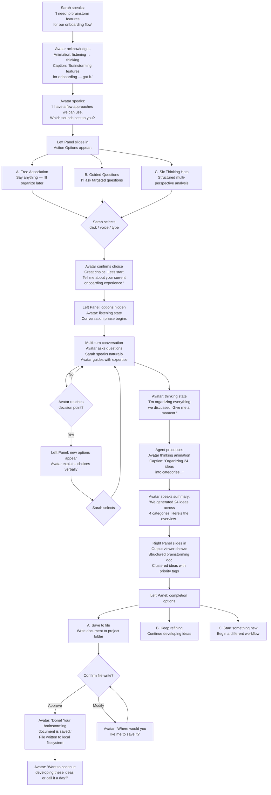
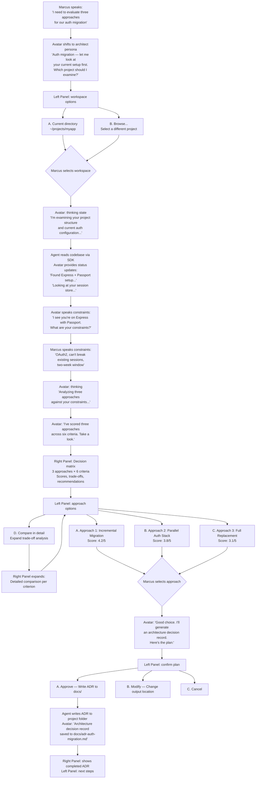
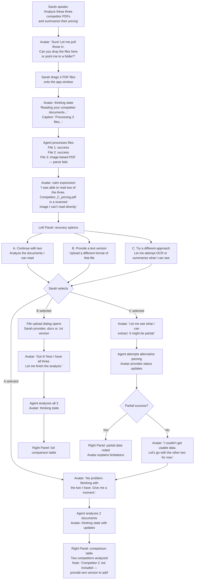
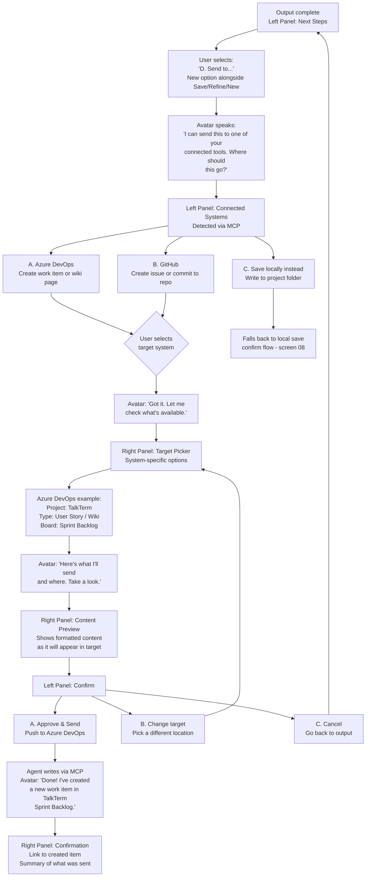

# UX Design Specification TalkTerm

**Version:** 1.5
**Author:** Root
**Date:** 2026-03-24
**Original Date:** 2026-03-21

---

<!-- UX design content will be appended sequentially through collaborative workflow steps -->

## Executive Summary

### Project Vision

TalkTerm replaces the terminal with a personal, conversational companion that non-technical users speak to and delegate work to. The agent backend is commodity infrastructure; the avatar relationship layer is the product. The interaction model follows game-dialog UX — the avatar speaks context, graphical overlays present actionable options, and the user never sees a command, a log, or raw output. MVP targets macOS + Windows with a single animated avatar, voice I/O, Claude backend, and BMAD brainstorming as the showcase workflow.

### Target Users

**Primary — Non-technical power users:** Product managers, designers, analysts, and other knowledge workers who would benefit from agentic workflows but are excluded by CLI interfaces. They want to delegate structured work (brainstorming, research, analysis) to an AI agent without learning any technical tools. Canonical persona: Sarah, a PM who produces her first structured brainstorming artifact without technical assistance.

**Secondary — Technical users seeking visual workflows:** Developers who already use CLI agents but want a conversational, visual interface for structured tasks like architecture reviews and sprint planning. They value the overlay-based decision presentation and the ability to share outputs with non-technical teammates. Canonical persona: Marcus, a full-stack developer who uses TalkTerm for structured workflows alongside his terminal.

### Key Design Challenges

1. **Output rendering** — Bridging dense agent output to user comprehension via verbal summary + graphical overlay, not narration or scrolling text
2. **Conversational pacing** — Maintaining ≤1s acknowledgement / ≤3s first response feel with avatar animation as the primary progress indicator during agent work
3. **Trust calibration** — Confirm-plan pattern must feel protective without creating friction for non-technical users who've never delegated to an agent
4. **Onboarding-by-doing** — First BMAD brainstorming session IS the onboarding; avatar must guide users from cold start to real output in under 25 minutes
5. **Cross-platform voice** — Consistent voice input experience across macOS and Windows despite platform differences in Web Speech API and mic permissions

### Design Opportunities

1. **Avatar as emotional anchor** — A face, voice, and personality create retention and trust that no text-based AI tool can match
2. **Game-dialog overlay system** — Clickable decision cards, visual matrices, and expandable clusters offer a dramatically better interaction pattern than chat or terminal for structured workflows
3. **Zero-learning-curve delegation** — If conversational flow is nailed, TalkTerm becomes the first agent tool a non-technical user picks up and uses productively on day one

## Core User Experience

### Defining Experience

The core TalkTerm experience is the combination of personality and power — producing real outputs by working with a personable avatar companion. The defining interaction loop: user speaks intent → avatar acknowledges and guides → agent executes with full system access → avatar presents results through gamified overlays. The magic is not in the conversation alone or the output alone — it's in achieving real outcomes through a relationship that feels like collaboration with a colleague.

The killer differentiator vs chatbots (ChatGPT, Claude.ai): TalkTerm doesn't just converse — it controls systems. Via the Claude Agent SDK and MCP, TalkTerm manages GitHub repos, Azure DevOps, file systems, and any connected service. Users get real system power delivered through a conversational, avatar-driven interface.

### Platform Strategy

- **MVP platforms:** macOS + Windows (Electron cross-platform single codebase)
- **Input:** Voice-first with full text alternative — both are first-class interaction modes
- **Interaction model:** Mouse/keyboard + voice; overlay cards are clickable and voice-selectable
- **Offline:** Not supported — internet required for AI agent backend API calls
- **Platform-specific:** OS credential store for API keys (Keychain / DPAPI), native microphone permissions, system tray presence for background awareness
- **Path to mobile:** Electron architecture supports future mobile companion app (Phase 3) without full rewrite

### Effortless Interactions

1. **First run:** Enter API key → pick your avatar → start talking. Three steps from install to first conversation. No account creation, no tutorials, no feature tours.
2. **Starting a workflow:** Just speak. "I need to brainstorm features for our onboarding flow." The avatar takes it from there — no workflow selection menus, no configuration.
3. **Understanding output:** Avatar verbally summarizes what was produced, then the overlay shows the structured result. User never has to parse raw text or figure out what happened.
4. **Resuming work:** Avatar greets returning users by name and offers to continue where they left off. One click or one sentence to resume.
5. **Making decisions:** Overlay cards present clear, clickable options. No typing required. Pick a card, speak a choice, or approve a plan — all feel equally natural.

### Critical Success Moments

1. **"She has a face"** — Avatar appears, greets the user by name, speaks aloud. Instant separation from every text-based AI tool.
2. **"I just talked and it happened"** — User describes intent conversationally, avatar guides them, and a real artifact is produced. No commands, no learning curve.
3. **"Wait, it can DO that?"** — User discovers the agent isn't just chatting — it's reading repos, writing to project folders, connecting to DevOps systems. Real power through conversation.
4. **"I want to do that again"** — The gamified overlay UX makes selecting options and reviewing results feel rewarding. Structured work becomes engaging, not laborious.

### Experience Principles

1. **Companion, not tool** — Every interaction should feel like delegating to a colleague, not operating software. The avatar's personality, voice, and presence are load-bearing UX, not decoration.
2. **Talk to outcome** — The path from user intent to real output is entirely conversational. No intermediate UI beyond API key entry and avatar selection.
3. **Power through simplicity** — Full agent capability (file system, MCP, shell, APIs) is accessible but invisible. Users see decisions and results, never machinery.
4. **Gamified decisions** — Option selection, confirmations, and output presentation feel rewarding and tactile — overlay cards, visual frameworks, clear choices that make structured work engaging.
5. **Real work, not chat** — Every session should end with something tangible: a document created, a system updated, an action taken. TalkTerm produces outcomes, not transcripts.

## Desired Emotional Response

### Primary Emotional Goals

1. **Wonder & Excitement** — The first encounter with the avatar should spark genuine curiosity. "What else can it do?" is the feeling that drives exploration and engagement.
2. **Effortless Progress** — The defining emotional state during workflows. Users should feel like they're accomplishing more, faster, by directing rather than doing. Delegation that feels like a superpower.
3. **Trust & Safety** — When things go wrong, users should feel unfazed. The avatar handles problems with calm competence — "let's try another way" — not alarm or confusion.
4. **Pride in Output** — After completing a workflow, users should feel accomplishment — they directed the work, the result is theirs, and it's better than what they could have produced alone in the same time.

### Emotional Journey Mapping

| Stage | Target Emotion | Design Driver |
|---|---|---|
| First launch | Excitement, wonder, curiosity | Avatar appears, speaks your name, introduces herself with personality |
| API key setup | Confidence, simplicity | Quick, painless — one field, done. No friction before the magic |
| Avatar selection | Anticipation, personal connection | Choosing your companion — this is YOUR assistant |
| First conversation | Delight, surprise | Avatar responds naturally, asks smart questions, feels like a real collaborator |
| During workflow | Effortless progress, flow state | Work is happening fast. Options appear as cards. Decisions feel quick and clear |
| Output delivery | Pride, accomplishment | "I just produced a real artifact by talking." Shareable, tangible result |
| Error encounter | Reassurance, calm | "No problem — let's try another way." Avatar is unflappable and solution-oriented |
| Return visit | Warmth, continuity | Avatar remembers you, picks up where you left off. Feels like returning to a colleague's desk |

### Micro-Emotions

**Critical to cultivate:**
- **Confidence over confusion** — User always knows what's happening and what to do next. The avatar and overlays make the current state obvious.
- **Excitement over anxiety** — Agent capability should feel empowering, not scary. The confirm-plan pattern provides control without creating dread.
- **Delight over mere satisfaction** — The gamified overlay interactions should spark small moments of pleasure — selecting a card, seeing results appear, watching the avatar react.
- **Accomplishment over frustration** — Every session ends with a tangible outcome. Even partial progress feels like progress.

**Critical to prevent:**
- **Boredom** — The explicit anti-emotion. Current tools are "boring and hard to use." TalkTerm must never feel like a chore.
- **Helplessness** — User should never feel stuck, lost, or unsure what to do. The avatar always offers a path forward.
- **Distrust** — User should never wonder "what did it just do?" The confirm-plan pattern and verbal summaries maintain transparency.
- **Impatience** — The avatar's thinking animation and conversational pacing must prevent the feeling of waiting. The user should feel the agent is working, not stalling.

### Design Implications

| Emotional Goal | UX Design Approach |
|---|---|
| Wonder & excitement | Avatar personality shines immediately — voice, animation, greeting by name. First 30 seconds must feel alive, not like a loading screen. |
| Effortless progress | Minimize user effort per decision. Overlay cards are one-click. Voice selection is one sentence. Progress is visible and continuous. |
| Trust & safety | Errors delivered with avatar warmth and concrete alternatives. "There are many ways to get things done" tone. Never blame the user. Never show technical details. |
| Pride in output | Verbal summary celebrates the result before showing it. "We've built something great" framing. Output overlay is polished and presentation-ready. |
| Anti-boredom | Avatar animation is continuous and varied. Overlay transitions feel snappy. No dead time — avatar always has something to say or show during agent work. |
| Flow state | Reduce cognitive load at every decision point. Cards present 2-4 clear options, not long lists. Avatar guides without requiring the user to think about process. |

### Emotional Design Principles

1. **Personality is medicine** — The avatar's warmth, humor, and conversational tone transform potentially stressful moments (errors, long waits, complex decisions) into manageable ones. The persona is a design tool, not a feature.
2. **Progress is the reward** — The dopamine loop is effortless accomplishment. Every interaction should move the user visibly closer to a tangible result. No busywork, no dead ends.
3. **Calm competence over flashy recovery** — Errors are not dramatic. The avatar treats problems like a competent colleague would — matter-of-fact, solution-oriented, never flustered.
4. **The first 30 seconds sell the product** — Wonder and curiosity in the opening moments create the emotional foundation for everything that follows. If the avatar greeting doesn't spark excitement, nothing else matters.
5. **Never boring, never overwhelming** — The emotional sweet spot is engaged flow. Too little stimulation = the old boring tools. Too much = cognitive overload. The gamified overlay system must hit the middle.

## UX Pattern Analysis & Inspiration

### Inspiring Products Analysis

**Primary Inspiration: A Good Colleague**

The target users' UX benchmark is not an app — it's a competent human coworker. What users value most: face time (being seen and heard), effective outcomes (real work gets done), and clarity (knowing what happened and what's next). TalkTerm's UX must meet this bar — the avatar is a digital colleague, not a software interface.

This insight is fundamental: TalkTerm is not competing with other AI tools on features. It's competing with the experience of delegating to a trusted person. The UX must deliver on that emotional contract.

**Game-Dialog Interaction Model (Mass Effect, Firewatch, Persona)**

From the brainstorming session, the game-dialog UX pattern emerged as the core interaction model. These games nail a specific experience: a character speaks to you, context is delivered through personality, options appear as visual choices, you pick, the story continues. Key patterns:
- Character speaks context — you don't read a wall of text
- Options are visual, clickable, and limited (2-4 choices, not open-ended)
- Selection feels consequential and satisfying
- The conversation drives forward — no backtracking, no menus
- Personality makes information delivery engaging rather than tedious

**Anti-Inspiration: Gemini Live Mode**

Gemini Live Mode validated market demand for voice-first AI interaction but failed on every dimension that defines TalkTerm's value:
- **All talk, no action** — Conversational but cannot execute, control systems, or produce artifacts
- **No tools** — Cannot access file systems, APIs, MCP integrations, or any external service
- **No structured output** — Voice-only with no visual overlay for decisions, results, or structured data
- **No context/memory** — No session continuity, no project awareness, no user profile
- **Gimmick feel** — Fine for asking questions, terrible for getting real work done

Gemini Live Mode is what TalkTerm looks like without the agent layer, without the overlay system, and without real capability. It's a cautionary example of voice-first AI that stops at conversation.

### Transferable UX Patterns

**From the "good colleague" model:**

| Pattern | Application in TalkTerm |
|---|---|
| Active listening signals | Avatar shows listening state — animation change, eye contact, acknowledgement sounds. User feels heard. |
| Clarifying questions before action | Avatar asks smart follow-up questions before diving into work, like a colleague would. Not "processing your request" — "Let me make sure I understand what you need." |
| Status updates during work | "I'm looking at your repo now" / "I found 3 approaches, let me organize them" — natural progress updates, not progress bars. |
| Clear handoff of results | Verbal summary of what was done, then structured visual presentation. Like a colleague walking you through a deliverable. |

**From game-dialog UX:**

| Pattern | Application in TalkTerm |
|---|---|
| Character-delivered context | Avatar speaks information; user listens and decides rather than reads and types |
| Visual option cards | Overlay cards for decisions — 2-4 options, clickable, with enough context to choose confidently |
| Forward momentum | Conversation always moves forward. No dead ends. Avatar always offers next steps. |
| Consequential selection | Choosing an option feels meaningful — the avatar reacts, work proceeds, results change based on choice |

### Anti-Patterns to Avoid

1. **The Gemini trap: voice without capability** — Never let TalkTerm feel like "just talking to an AI." Every conversation must be visibly connected to real actions and real output.
2. **The chatbot wall of text** — Never dump long text responses. Avatar speaks summaries; overlays show structured data. No scrolling through paragraphs.
3. **The assistant that forgets** — No session amnesia. Avatar must reference past work, remember the user's name, and offer continuity. Context loss destroys the colleague illusion.
4. **The confirmation treadmill** — Don't over-confirm. The confirm-plan pattern should protect the user without making every action feel bureaucratic. Confirm destructive actions; let routine work flow.
5. **The loading screen** — Never show a blank, frozen, or spinner state. The avatar's thinking animation IS the loading state. The user should feel the agent is working, not waiting.

### Design Inspiration Strategy

**What to Adopt:**
- Colleague-quality interaction: listening signals, clarifying questions, verbal status updates, clear result handoffs
- Game-dialog option presentation: visual cards, limited choices, forward momentum, consequential selection
- Avatar as the entire interface: no menus, no navigation, no settings screens during workflow — the avatar and overlays handle everything

**What to Adapt:**
- Game-dialog pacing adapted for productivity (faster than narrative games — users want efficiency, not drama)
- Colleague interaction adapted for async capability (agent works while avatar provides updates — a colleague who works at machine speed)

**What to Avoid:**
- Voice-only interaction without visual output (Gemini Live Mode failure)
- Chat-style text dumps (ChatGPT/Claude.ai pattern)
- Session amnesia and context loss
- Over-confirmation that breaks flow
- Any UI that feels like "operating software" rather than "talking to a colleague"

## Design System Foundation

### Design System Choice

**Tailwind CSS** — utility-first CSS framework with no component library. TalkTerm's UI is entirely custom (avatar canvas, overlay cards, voice input, captions) with no standard form layouts, tables, or navigation patterns that would benefit from pre-built components.

### Rationale for Selection

1. **Full visual control** — Game-dialog aesthetic requires custom styling that doesn't fight opinionated component libraries. Nothing should look "off the shelf."
2. **Solo developer velocity** — Utility classes enable rapid prototyping and iteration without context-switching between CSS files and components. Consistent spacing, typography, and color scales built in.
3. **No component opinion conflicts** — TalkTerm has zero standard UI patterns (no forms, no sidebars, no tables, no page routing). A component library would be unused overhead.
4. **Custom component alignment** — Every TalkTerm UI element is purpose-built: `<AvatarCanvas>`, `<OverlayStack>`, `<OverlayCard>`, `<VoiceInput>`, `<Captions>`. Tailwind styles these directly without abstraction layers.
5. **Ecosystem maturity** — Excellent documentation, large community, proven in production Electron + React apps.

### Implementation Approach

- Install Tailwind CSS with PostCSS in the Vite renderer build pipeline
- Define design tokens as Tailwind theme extensions (colors, spacing, typography, animation timing)
- Use Tailwind's `@apply` sparingly — prefer utility classes in JSX for component-level styling
- Leverage Tailwind's built-in responsive utilities for window resizing behavior
- Use Tailwind's animation utilities for overlay card transitions and micro-interactions

### Customization Strategy

**Design Tokens (Tailwind Theme Extensions):**
- **Color palette:** Avatar-personality-driven accent colors, dark/neutral background tones for the avatar stage, high-contrast overlay card backgrounds
- **Typography:** Clear, readable font stack for captions and overlay text; size scale optimized for desktop viewing distances
- **Spacing:** Consistent scale for overlay card padding, avatar canvas margins, input area sizing
- **Animation:** Custom timing curves for overlay card enter/exit, avatar state transitions, card hover/selection feedback
- **Shadows & depth:** Layered shadow system for overlay card stack depth — cards should feel elevated above the avatar stage

**Component-Level Patterns:**
- Overlay cards: Consistent border radius, padding, shadow, and hover state across all card types (decision, output, error, confirmation)
- Interactive states: Unified hover, focus, active, and selected states for all clickable elements (cards, buttons, voice input toggle)
- Text captions: Consistent positioning, background opacity, and font sizing for avatar speech captions

## Defining Experience

### The Core Interaction

**"Get your own virtual expert software development team."**

The defining experience is not a UI mechanic — it's a role shift. The user goes from operating tools to directing specialists. TalkTerm gives every user — technical or not — a team of expert personas they can delegate to by speaking naturally. The avatar is the team member; the conversation is the management interface; the output is the deliverable.

In MVP, a single avatar embodies different BMAD agent personas depending on the task context — analyst for brainstorming, architect for technical decisions, PM for planning. The user experiences role-appropriate expertise and personality shifts within one avatar, establishing the "team" mental model that scales to multiple distinct avatars in Phase 2.

### User Mental Model

**The user is a director. The avatars are the team.**

| Mental Model Element | User's Perspective |
|---|---|
| Role | Manager/director who gives direction and makes decisions |
| Avatar | A specialist team member with expertise the user may lack |
| Conversation | Delegation — "I need X done" not "How do I use this tool?" |
| Overlay cards | Deliverables and decision points brought to you for review |
| Output artifacts | Team work product — the user directed it, the team produced it |
| Errors | A team member hitting a snag and proposing alternatives |
| Session resume | Picking up where you left off with your team |

**Current solutions force the wrong mental model:**
- ChatGPT/Claude.ai: User is the operator — types prompts, reads responses, copies output manually. The tool waits passively.
- Claude Code/Copilot CLI: User is the engineer — must know the terminal, understand commands, parse text output. The tool assumes expertise.
- Gemini Live Mode: User is a questioner — asks things, gets answers, but nothing actually happens. The tool is a voice encyclopedia.

**TalkTerm's mental model:** User is the boss. The avatar is a competent team member who asks clarifying questions, does the work, presents results, and asks for approval on important decisions. The user's job is to direct and decide — not to operate, engineer, or question.

### Success Criteria

| Criterion | Indicator |
|---|---|
| Users feel like directors, not operators | User speaks intent ("I need a brainstorming session on X") rather than instructions ("Open the brainstorming tool and configure it for X") |
| Delegation feels natural | User talks to the avatar the way they'd talk to a colleague — no special syntax, no mode switching |
| Team expertise is visible | Avatar demonstrates domain knowledge through smart questions, structured approaches, and expert-level output — user trusts the specialist |
| Output feels like team work product | User says "my team produced this" not "I generated this with a tool" |
| The "team" scales in user's mind | Even with one avatar in MVP, user anticipates and desires additional team members — the mental model sticks |

### Novel UX Patterns

TalkTerm combines familiar patterns in an innovative way:

**Familiar patterns users already understand:**
- Talking to a colleague (universal — everyone knows how to delegate verbally)
- Reviewing deliverables (overlay cards = documents brought to your desk for review)
- Approving/rejecting work (confirm-plan pattern = manager sign-off)

**Novel combination that requires no education:**
- Avatar persona + voice conversation + overlay cards + real agent execution
- Each element is individually familiar; the combination is new but instantly intuitive
- No onboarding needed because the metaphor is "working with a person" — the most natural interaction pattern humans have

**The key innovation:** The avatar doesn't just present information (like a chatbot) or just execute commands (like a CLI). It **works like a team member** — it asks questions, proposes approaches, does the work, presents results, and handles problems. This is a novel product pattern built from universally familiar human interactions.

### Experience Mechanics

**1. Initiation — "Assigning work to your team member"**
- User opens TalkTerm → avatar greets by name, asks what they need
- User speaks naturally: "I need to brainstorm features for our onboarding flow"
- Avatar acknowledges and shifts into the appropriate BMAD persona role
- No workflow selection, no configuration — the avatar infers the task from natural language

**2. Interaction — "Working with your specialist"**
- Avatar asks clarifying questions (like a good colleague would before starting work)
- User and avatar have a back-and-forth — the avatar guides with expertise, the user provides direction and domain knowledge
- When the avatar needs decisions, overlay cards appear with 2-4 clear options
- User selects by clicking a card or speaking a choice
- For actions that modify files or systems, avatar presents the plan for approval

**3. Feedback — "Your team member keeping you posted"**
- Avatar's animation state changes: listening → thinking → speaking
- During agent work, avatar provides natural status updates: "I'm looking at your project structure now" / "I've found three approaches, let me organize them"
- No progress bars, no spinners — the avatar IS the progress indicator
- Text captions accompany all avatar speech for accessibility

**4. Completion — "Your team member delivering the work"**
- Avatar verbally summarizes what was produced (2-4 sentences)
- Output overlay appears with the structured artifact — expandable, reviewable
- Avatar asks: "Want to continue developing this, start something new, or call it a day?"
- Output file is accessible on local file system
- Session state persisted — can resume anytime

## Visual Design Foundation

### Color System

**Base Palette: PwC Brand Colors (Flame Palette)**

Adapted for TalkTerm's dark-stage + light-overlay UI model:

| Role | Color | Hex | Usage |
|---|---|---|---|
| Primary | Tangerine | #EB8C00 | Primary accent, active states, avatar highlight ring, selected overlay card borders |
| Primary Light | Yellow | #FFB600 | Hover states, progress indicators, avatar speaking glow |
| Primary Dark | Dark Orange | #D04A02 | Pressed states, emphasis text, important action buttons |
| Accent | Rose | #DB536A | Notifications, error-adjacent states, attention-drawing elements |
| Danger | Red | #E0301E | Destructive action warnings, error states in confirmation overlays |

**Stage & Surface Colors:**

| Role | Hex | Usage |
|---|---|---|
| Stage Background | #1A1A1A | Avatar canvas background — dark theater stage |
| Stage Gradient | #1A1A1A → #0D0D0D | Subtle vertical gradient for depth |
| Surface (Overlay Cards) | #FFFFFF | Overlay card backgrounds — high contrast against dark stage |
| Surface Elevated | #F5F5F5 | Nested content within overlay cards |
| Surface Muted | #2A2A2A | Secondary panels (audit log, session list) |
| Text Primary | #1A1A1A | Body text on light surfaces |
| Text Secondary | #6B6B6B | Supporting text, labels on light surfaces |
| Text on Dark | #F0F0F0 | Text on dark stage surfaces |
| Text Muted on Dark | #A0A0A0 | Captions, secondary text on dark stage |
| Border | #E0E0E0 | Overlay card borders (default state) |
| Border Active | #EB8C00 | Overlay card border when selected/focused |

**Semantic Color Mapping:**

| Semantic Role | Color | Context |
|---|---|---|
| Success | #2E7D32 | Workflow completed, action confirmed |
| Warning | #EB8C00 (Primary) | Caution states, plan review prompts |
| Error | #E0301E | Failed actions, connectivity loss |
| Info | #1565C0 | Informational overlays, status updates |
| Thinking | #EB8C00 at 60% opacity | Avatar thinking state glow, pulsing |

**Design Rationale:**
- PwC's flame palette communicates warmth, expertise, and trustworthiness — aligning with the "polished professional" emotional goal
- Dark stage creates a theater/presentation atmosphere that makes the avatar feel present and alive
- White overlay cards on dark background create strong visual hierarchy — decisions and content pop
- Tangerine (#EB8C00) as primary accent is warm and distinctive without being playful or corporate-blue
- The palette avoids game-like vibrancy while maintaining energy and visual engagement

### Typography System

**Primary Typeface: Inter**
- Clean, professional, highly legible on screens
- Designed specifically for computer interfaces
- Excellent at small sizes (captions) and large sizes (overlay headings)
- Variable font support for precise weight control
- Free, open-source — no licensing concerns

**Type Scale:**

| Level | Size | Weight | Line Height | Usage |
|---|---|---|---|---|
| Display | 28px | 600 (Semi-bold) | 1.2 | Output overlay titles, welcome greeting |
| H1 | 22px | 600 | 1.3 | Overlay card headings, section titles |
| H2 | 18px | 500 (Medium) | 1.3 | Card subheadings, category labels |
| Body | 15px | 400 (Regular) | 1.5 | Overlay card content, descriptions |
| Body Small | 13px | 400 | 1.5 | Supporting text, metadata |
| Caption | 12px | 500 | 1.4 | Avatar speech captions, timestamps, status text |

**Typography Principles:**
- All avatar speech captions use Caption size with semi-transparent dark background for readability over the avatar stage
- Overlay card text uses Body size with generous line height for scanability
- No more than 2 font weights on any single overlay card — keep it clean
- Text on dark surfaces uses Text on Dark color (#F0F0F0) — never pure white (#FFFFFF) to reduce eye strain

### Spacing & Layout Foundation

**Base Unit: 4px**
- All spacing values are multiples of 4px for consistency
- Primary spacing scale: 4, 8, 12, 16, 24, 32, 48, 64px

**Layout Zones:**

```
┌─────────────────────────────────────────────┐
│                 App Window                   │
│  ┌─────────────────────────────────────────┐ │
│  │           Avatar Stage                  │ │
│  │    (dark background, centered avatar)   │ │
│  │                                         │ │
│  │         ┌───────────────┐               │ │
│  │         │   Avatar      │               │ │
│  │         │   Canvas      │               │ │
│  │         └───────────────┘               │ │
│  │                                         │ │
│  │    ┌─────────────────────────────┐      │ │
│  │    │    Caption Bar              │      │ │
│  │    └─────────────────────────────┘      │ │
│  │                                         │ │
│  │  ┌─────┐ ┌─────┐ ┌─────┐ ┌─────┐      │ │
│  │  │Card │ │Card │ │Card │ │Card │      │ │
│  │  │  1  │ │  2  │ │  3  │ │  4  │      │ │
│  │  └─────┘ └─────┘ └─────┘ └─────┘      │ │
│  │         Overlay Card Area               │ │
│  │                                         │ │
│  │  ┌─────────────────────────────────┐    │ │
│  │  │  Voice/Text Input Area          │    │ │
│  │  └─────────────────────────────────┘    │ │
│  └─────────────────────────────────────────┘ │
└─────────────────────────────────────────────┘
```

**Zone Specifications:**

| Zone | Behavior | Spacing |
|---|---|---|
| Avatar Stage | Full window background, avatar centered vertically in upper 60% | 48px horizontal padding |
| Caption Bar | Fixed position below avatar, horizontally centered | 16px padding, 8px vertical margin |
| Overlay Card Area | Cards appear in lower portion, horizontally arranged | 16px gap between cards, 24px from edges |
| Input Area | Fixed to bottom of window | 16px padding, 24px from bottom edge |
| Overlay Panels (expanded) | Slide up from card area, can fill up to 70% of window height | 32px padding inside panel |

**Layout Principles:**
- Avatar is always visible — overlays never fully obscure the avatar. Maximum overlay height is 70% of window.
- Cards are horizontally arranged (2-4 per row) with consistent gap spacing
- Window resizing scales the avatar stage proportionally; overlay cards reflow responsively
- Input area is always accessible at bottom — never hidden by overlays
- Minimum window size: 800x600px (ensures cards and avatar remain usable)

### Accessibility Considerations

**Contrast Ratios (WCAG AA Compliance):**
- Text on light surfaces: #1A1A1A on #FFFFFF = 16.75:1 (passes AAA)
- Text on dark surfaces: #F0F0F0 on #1A1A1A = 15.3:1 (passes AAA)
- Primary accent on dark: #EB8C00 on #1A1A1A = 5.2:1 (passes AA for normal text)
- Caption text on dark: #A0A0A0 on #1A1A1A = 5.4:1 (passes AA)

**Interaction Accessibility:**
- All overlay cards meet 32x32px minimum click target (NFR11)
- Focus states use Primary accent (#EB8C00) 2px border — visible on both light and dark surfaces
- Hover states provide clear visual feedback (color shift + subtle scale)
- Keyboard navigation supported for all overlay card interactions
- Avatar speech always accompanied by text captions (NFR12)

**Color Independence:**
- No information conveyed by color alone — success/error states include icons and text labels
- Semantic colors paired with shape indicators (checkmark for success, X for error, triangle for warning)

## Design Direction Decision

### Design Directions Explored

Seven design directions were generated and evaluated against TalkTerm's core experience principles:

1. **Centered Stage** — Classic vertical flow, simplest game-dialog layout
2. **Theater Wide** — Full-width with horizontal scrolling card rail
3. **Side Panel** — Avatar stage with persistent content panel
4. **Immersive** — Large avatar with ambient glow, semi-transparent cards
5. **Compact Professional** — Mini avatar in top bar, maximized content area
6. **Output Focus** — Small avatar, large output panel for deliverable review
7. **Floating Cards** — Centered stage with 3D perspective tilt on cards

Interactive mockups generated at `_bmad-output/planning-artifacts/ux-design-directions.html`.

### Chosen Direction

**Three-Zone Layout** — adapted from Direction 3 (Side Panel), with significant modifications:

```
┌──────────────┬─────────────────────────────┬──────────────────┐
│ Left Panel   │       Center Stage          │  Right Panel     │
│              │                             │  (optional)      │
│ Workflow     │    ┌─────────────────┐      │                  │
│ Action       │    │                 │      │  Output/Detail   │
│ Options      │    │     Avatar      │      │  Viewer          │
│              │    │     Canvas      │      │                  │
│ ┌──────────┐ │    │                 │      │  Plans, drafts,  │
│ │ A. Do X  │ │    └─────────────────┘      │  documents,      │
│ └──────────┘ │                             │  structured      │
│ ┌──────────┐ │    ┌─────────────────────┐  │  results         │
│ │ B. Do Y  │ │    │   Caption Bar       │  │                  │
│ └──────────┘ │    └─────────────────────┘  │                  │
│ ┌──────────┐ │                             │                  │
│ │ C. Do Z  │ │    ┌─────────────────────┐  │                  │
│ └──────────┘ │    │ Voice/Text Input    │  │                  │
│              │    └─────────────────────┘  │                  │
└──────────────┴─────────────────────────────┴──────────────────┘
```

**Three zones:**

| Zone | Purpose | Behavior |
|---|---|---|
| Left Panel | Workflow action options — the next steps/choices the avatar presents | Shows labeled cards (A, B, C or 1, 2, 3) when avatar presents options. Empty/hidden while avatar is working. |
| Center Stage | Avatar presence + conversation | Always visible. Avatar canvas, caption bar, voice/text input. The emotional anchor. |
| Right Panel | Output/detail viewer | Optional — slides in when agent produces deliverables (plans, draft documents, structured output). Hidden when no output to display. |

**Left Panel — Action Options:**
- Cards are labeled with letter or number identifiers (A, B, C or 1, 2, 3)
- User can interact three ways: click the card, speak the identifier ("A" or "one"), or type it
- Panel is empty/hidden while the avatar is actively working (thinking state)
- Options appear when the avatar reaches a decision point and presents choices
- Replaces the floating overlay cards from the centered stage design — options live in a persistent, predictable location

**Right Panel — Output Viewer:**
- Slides in from the right when the agent produces viewable output
- Displays plans, draft documents, structured results, comparison matrices
- Scrollable for long content
- Can be dismissed by the user or collapses when conversation resumes
- Avatar remains visible in center stage while user reviews output

**Center Stage — Avatar Presence:**
- Always the primary focus area
- Avatar canvas centered in upper portion
- Caption bar below avatar for speech text
- Voice/text input anchored at bottom
- Flexes width based on panel visibility: full width when both panels hidden, narrows when panels are open

### Design Rationale

1. **Predictable option location** — Unlike floating overlay cards that appear in different positions, the left panel provides a consistent, predictable place for action options. Users always know where to look for "what can I do next?"
2. **Avatar stays unobscured** — Center stage is never covered by cards or output. The avatar — the emotional anchor — is always fully visible and present.
3. **Standard navigation position** — Left panel for actions follows conventional UI placement for navigation/action panels, reducing cognitive load.
4. **Output doesn't interrupt conversation** — Right panel slides in without disrupting the avatar interaction. User can review a document while the avatar continues explaining it verbally.
5. **Adaptive layout** — Three distinct states: (a) center stage only (avatar working), (b) center + left (decision point), (c) center + left + right (output review). Layout adapts to the workflow phase.
6. **Labeled cards enable multimodal selection** — Letter/number identifiers on action cards support click, voice, and text input equally — all three input modes work naturally.

### Implementation Approach

**Layout States:**

| State | Left Panel | Center Stage | Right Panel | When |
|---|---|---|---|---|
| Conversation | Hidden | Full width | Hidden | Avatar is speaking, listening, or working |
| Decision Point | Visible (action cards) | Narrowed | Hidden | Avatar presents choices to user |
| Output Review | Visible (action cards) | Narrowed | Visible (output) | Agent produces deliverable for review |
| Output Only | Hidden | Narrowed | Visible (output) | User reviewing output, no pending decisions |

**Responsive Behavior:**
- Minimum window width: 800px (center stage only) → 1100px (center + one panel) → 1400px (all three zones comfortable)
- On narrower windows, panels overlay the stage rather than pushing it — avatar always visible
- Left panel width: ~240px (enough for labeled action cards)
- Right panel width: ~380px (enough for document content readability)
- Center stage: remaining width, minimum 400px

## User Journey Flows

### Journey 0: First Launch & Setup

**Goal:** Get from install to first conversation in under 2 minutes. No friction, no confusion.

**Layout state:** Center stage only (no panels) — setup is intimate, focused, personal.

**This journey follows the combined state assessment defined in Journey 4.** On every launch, an admin privilege check runs first (FR39). On first launch, all four setup states (`apiKeyValid`, `profileComplete`, `avatarSelected`, `workspaceSelected`) are `false`, so the user proceeds through all four steps. On subsequent launches, the state assessment skips any completed steps — see Journey 4 for the full state matrix and flow diagram.

**First-time user path (all states = false):**

| Step | Center Stage | Left Panel | Right Panel | Duration |
|---|---|---|---|---|
| Admin Check | Automatic — passes silently if running as admin | Hidden | Hidden | <1s |
| Welcome | TalkTerm logo + welcome text | Hidden | Hidden | 2s auto-advance |
| Step 1: API Key | Key input + validation + help link (see API Key Setup design) | Hidden | Hidden | User-paced |
| Step 2: Profile | Name input ("What should I call you?") | Hidden | Hidden | 5s |
| Step 3: Avatar Pick | Avatar card(s) with preview | Hidden | Hidden | User-paced |
| Step 3.5: Workspace | Project folder browse, Git URL clone, or "Skip — use BMAD defaults" | Hidden | Hidden | User-paced |
| First Greeting | Avatar animates + speaks | Hidden | Hidden | Avatar speaks ~5s |

**Step 3.5 — Workspace Selection (FR52/FR53):**

The workspace screen offers two paths:
- **Option A — Use your project:** User browses for a local project folder or pastes a Git repository URL to clone. The agent gets full project context (codebase, existing docs, configuration) for workflows.
- **Option B — Skip (BMAD defaults):** User skips workspace selection. The system silently clones the BMAD-method repository (`github.com/bmadcode/BMAD-METHOD`) in the background as the default workspace. BMAD agent workflows have a valid working context with templates, agent configs, and workflow definitions. No user-visible progress or confirmation — the avatar proceeds directly to the greeting.

The user can connect a project repo later at any time through conversation ("use my project at /path" or "clone this repo for context").

**Key UX decisions:**
- No account creation, no email, no password — just API key, name, and optional workspace
- **Combined state assessment** after API key validation determines which setup steps to show (see Journey 4 state matrix)
- Avatar selection screen shows even with one avatar in MVP — establishes the "team" mental model ("choose your team member" implies there will be more)
- **Workspace is optional but valuable** — the skip path ensures zero-friction onboarding while the project path gives the agent richer context
- **Silent BMAD clone** — when the user skips, the BMAD-method repo is cloned silently so agent workflows (brainstorming, PRD, architecture) work out of the box with real templates
- The avatar's first words are the onboarding — no tutorial, no feature tour
- Setup screens use center stage only — no panels until the user is in a workflow
- Each step persists its result immediately — if the app crashes mid-setup, next launch resumes from the last incomplete step

---

### Journey 1: Sarah's First Workflow (BMAD Brainstorming)

**Goal:** Non-technical user completes a full brainstorming workflow and produces a structured output artifact in under 25 minutes.

**Persona:** Sarah, PM, first time using TalkTerm after setup.



**Key UX decisions:**
- Sarah never selects a "workflow" from a menu — she just describes what she needs and the avatar infers the approach
- Left panel appears only at decision points — hidden during free conversation
- Right panel appears only when output is ready — the avatar announces it verbally first
- Confirm-plan pattern used for file write (destructive action) but NOT for conversation choices
- The 25-minute target is achievable: ~2 min setup + ~18 min conversation + ~5 min review/save

**Layout state transitions during Journey 1:**

| Phase | Duration | Left Panel | Right Panel | Avatar State |
|---|---|---|---|---|
| Intent capture | 30s | Hidden | Hidden | Listening → Thinking |
| Technique selection | 30s | Visible (3 options) | Hidden | Speaking |
| Conversation | 15-18 min | Hidden (appears at decision points) | Hidden | Listening ↔ Speaking |
| Processing | 30-60s | Hidden | Hidden | Thinking (animated) |
| Output delivery | 1 min | Visible (completion options) | Visible (output doc) | Speaking → Ready |
| File save | 30s | Hidden | Visible | Speaking |

---

### Journey 2: Marcus's Terminal Replacement (Architecture Workflow)

**Goal:** Technical user runs a structured architecture evaluation with codebase analysis and produces a decision record.

**Persona:** Marcus, full-stack developer, experienced with CLI agents.



**Key UX decisions:**
- Avatar persona shifts to architect mode — same avatar, different expertise framing
- Workspace selection happens naturally through conversation, not a settings menu
- Agent actively reads the codebase (via Claude Agent SDK) — avatar narrates what it's finding
- Decision matrix appears in right panel while action options stay in left panel — user can review data AND select simultaneously
- Confirm-plan for file write to project folder (FR20)

---

### Journey 3: Sarah's Error Recovery

**Goal:** Error occurs mid-workflow; user recovers without confusion or fear.

**Persona:** Sarah, two weeks into using TalkTerm, comfortable with the product.



**Key UX decisions:**
- Error delivered conversationally — no error dialogs, no red banners, no technical details
- Avatar tone: calm, solution-oriented ("I was able to read two of the three" not "Error: file parse failed")
- Recovery options presented as actionable next steps, not error codes
- Three options (A, B, C) give Sarah control without requiring technical knowledge
- Partial completion is celebrated — "working with what we have" not "operation failed"
- The right panel shows results with a note about what's missing, not an error state

---

### New Functional Requirements (UX-Derived)

**FR39: Admin Privilege Check** — On every launch, TalkTerm MUST verify that the application is running with administrator/elevated privileges (macOS: root or admin group; Windows: Run as Administrator). If the app is NOT running as admin, it MUST display a blocking error screen with platform-specific instructions to relaunch as admin. The app MUST NOT proceed past this check until admin privileges are confirmed.

**FR40: API Key Setup Flow** — System MUST provide a guided API key entry experience that: (a) accepts an Anthropic API key via a single text input field, (b) validates the key against the Anthropic API before accepting it, (c) stores the validated key securely in the OS credential store via `safeStorage`, (d) displays inline validation feedback (success or specific error reason), and (e) provides a help link explaining how to obtain an API key.

**FR41: API Key State Management** — System MUST detect and handle three API key states on every launch: (a) no key stored — route to API key entry, (b) key stored and valid — proceed to next setup step, (c) key stored but expired/revoked — route to API key entry with a clear message explaining the key is no longer valid and must be replaced.

**FR42: Launch State Assessment** — On every launch, after the admin privilege check passes, the system MUST simultaneously assess the combined state of API key validity, user profile completeness, and avatar selection to determine the correct entry point. The system MUST NOT check these states sequentially — all three are evaluated together to route the user directly to the first incomplete step.

**FR43: Task Progress Display** — During multi-step agent workflows, the right panel MUST display a live task progress view showing: each workflow step with status (pending/in-progress/completed/failed), a visual progress indicator, elapsed time per step, and live counters for workflow-specific metrics (e.g., "18 ideas generated"). Progress updates MUST be driven by the SDK message stream in real time.

**FR44: Plan Preview Display** — Before executing a multi-step workflow, the system MUST present a plan preview in the right panel showing: numbered steps with descriptions, estimated scope, and approach summary. The plan MUST be presented as part of the confirm-plan pattern (FR20) with left panel options to approve, modify, or choose a different approach. On approval, the plan preview MUST transition to the task progress view automatically.

**FR45: Rich Content Rendering** — The right panel MUST support multiple display modes that auto-select based on content type: task progress (live workflow tracking), plan preview (proposed approach), document (rendered markdown), comparison table (scored matrix with color coding and expandable rows), clustered cards (categorized ideas with expandable groups), and activity feed (streaming agent action log, hidden by default).

**FR46: Cross-Session Memory Persistence** — System MUST persist conversation context, user decisions, project vocabulary, and workflow outcomes across sessions using Claude Agent SDK session persistence. On session resume, the avatar MUST have access to the full history of prior sessions for the active workspace.

**FR47: Natural Memory References** — Avatar MUST reference past work naturally in conversation when contextually relevant (e.g., "Last week you chose the incremental migration approach — want to check how that's going?"), without requiring the user to remind it of prior decisions or context. This strengthens the "colleague" mental model — a team member who remembers what you've worked on together.

**FR52: Workspace Selection** — After avatar selection and before first conversation, system MUST present a workspace screen with two paths: (a) user selects a local folder or provides a Git URL to clone, or (b) user skips, and the system silently clones the BMAD-method repo as the default workspace. Persisted across sessions.

**FR53: Silent BMAD Clone** — When user skips workspace selection, the BMAD-method repo clone MUST happen silently in the background with no user-visible progress. The avatar proceeds directly to greeting. User can connect a project repo later via conversation.

**FR51: Preference Memory** — System MUST track user interaction patterns (frequently chosen options, preferred techniques, default output destinations, workflow-specific settings) and persist them across sessions using context-scribe as the preference engine. Learned preferences surface as prioritized defaults or pre-selected options. Preferences are scoped per agent type and per workspace. Users override any learned preference by simply choosing differently — the system adapts without requiring a reset.

**FR54: Contextual Writeback** — The writeback method at workflow completion MUST be contextual based on session origin: (a) ADO work item session → default to ADO writeback; (b) Git repo workspace → default to commit + PR; (c) local files/BMAD defaults → default to local file save. All three paths available as alternatives, but the contextual default is pre-selected.

**FR55: Pull Request Flow** — When user selects "Open Pull Request", system creates a feature branch (e.g., `brainstorming/onboarding-features`), commits the artifact, pushes, and opens a PR with a generated title and description. The PR link is displayed in the right panel confirmation view.

**FR56: ADO Writeback Flow** — When user selects ADO writeback, system identifies the originating work item, pre-fills the target, previews content formatted for ADO, and writes back via MCP. Confirmation shows link to updated ADO item.

---

### Confirm Action — Contextual Writeback (FR54/FR55/FR56)

The confirm action screen (screen 08) adapts its default based on how the session originated:

| Session Context | Default Action | Avatar Says | Confirm Card Default |
|---|---|---|---|
| **ADO work item** | Write back to source ADO item | "I'll update the work item you started from. Want me to write it back, or save somewhere else?" | "Update Work Item" (primary) |
| **Git repo workspace** | Commit & offer PR | "I'll commit this to your repo. Push directly, or open a pull request?" | "Open Pull Request" (primary) |
| **Local files / BMAD** | Save file locally | "I'll save this to your project folder. Ready?" | "Save to File" (primary) |

**All three writeback paths are always available** — the context determines which is presented first and pre-selected, but the user can always switch:

**ADO context confirm card:**
- Pre-filled: source work item ID, project, target (description update / attachment / linked wiki page)
- Buttons: **"Update Work Item"** (Primary) → **"Open PR instead"** (Blue) → **"Save locally"** (Ghost)
- After writeback: right panel shows link to updated ADO item

**Repo context confirm card:**
- Shows: file path in repo, auto-generated commit message
- Buttons: **"Open Pull Request"** (Primary) → **"Commit & Push"** (accent) → **"Save locally"** (Ghost)
- After PR: right panel shows PR link, branch name, summary

**Local context confirm card:**
- Shows: file path, file size
- Buttons: **"Save to File"** (Primary) → **"Send to..."** (Blue, routes to writeback screen) → **"Cancel"** (Ghost)
- Standard behavior — no git operations

---

### User Story: API Key Setup

**As a** new TalkTerm user launching the app for the first time,
**I want to** enter my Anthropic API key in a clear, guided setup screen,
**So that** TalkTerm can connect to Claude and I can start working with my avatar team.

**Acceptance Criteria:**
1. A single text input field is presented with placeholder text showing the key format (`sk-ant-api03-...`)
2. A "How do I get an API key?" help link is visible below the input, opening the Anthropic console in the system browser
3. On submission, the key is validated against the Anthropic API (not just format-checked)
4. If valid: key is encrypted and stored via `safeStorage`, a subtle success indicator appears, and the user proceeds to the next setup step
5. If invalid: an inline error message appears below the field explaining why ("That key didn't work — check for typos", "This key has been revoked", "Unable to reach the API — check your internet connection")
6. The API key is never displayed in plaintext after entry — the field shows masked characters
7. The user can re-enter a key at any time via a settings option (accessible from the avatar conversation)

---

### User Story: Admin Privilege Check

**As a** TalkTerm user launching the app,
**I want** the app to verify it has the necessary system permissions before starting,
**So that** the Claude Agent SDK can access the file system, run shell commands, and use MCP tools without permission failures mid-workflow.

**Acceptance Criteria:**
1. On every launch, TalkTerm checks for admin/elevated privileges before any other operation
2. If running as admin: check passes silently, no UI shown, proceed to state assessment
3. If NOT running as admin: a blocking error screen is displayed (center stage, no panels)
4. The error screen shows platform-specific relaunch instructions
5. The app does not proceed past this screen — no setup, no avatar, no conversation — until admin privileges are confirmed

---

### Design: Admin Privilege Check Screen

**Layout:** Center stage only. Blocking — no dismiss, no skip.

```
┌─────────────────────────────────────────────┐
│              TalkTerm (titlebar)             │
├─────────────────────────────────────────────┤
│                                             │
│            ⚠ (warning icon)                 │
│                                             │
│     TalkTerm needs admin privileges         │
│                                             │
│   TalkTerm requires administrator access    │
│   to manage files, run tools, and connect   │
│   to your development environment.          │
│                                             │
│   ┌───────────────────────────────────────┐ │
│   │  macOS:                               │ │
│   │  Right-click TalkTerm → "Open as      │ │
│   │  Administrator", or run from terminal:│ │
│   │  sudo /Applications/TalkTerm.app/...  │ │
│   │                                       │ │
│   │  Windows:                             │ │
│   │  Right-click TalkTerm → "Run as       │ │
│   │  administrator"                       │ │
│   └───────────────────────────────────────┘ │
│                                             │
│          [ Retry ]    [ Quit ]              │
│                                             │
└─────────────────────────────────────────────┘
```

**Visual spec:**
- Background: Stage dark (#1A1A1A)
- Warning icon: 48px, Danger color (#E0301E)
- Title: Display size (28px, Semi-bold), Text on Dark (#F0F0F0)
- Body text: Body size (15px, Regular), Text Muted on Dark (#A0A0A0)
- Instruction box: Surface Muted (#2A2A2A) background, 16px padding, rounded 8px, Body Small (13px), monospace for terminal commands
- Only the platform-relevant instruction is shown (macOS instructions on macOS, Windows instructions on Windows)
- **Retry button:** Primary accent (#EB8C00) — re-checks admin privileges without restarting
- **Quit button:** Ghost style — closes the application

---

### Design: API Key Setup Screen

**Layout:** Center stage only. Part of the setup flow (after admin check passes, before profile setup).

```
┌─────────────────────────────────────────────┐
│              TalkTerm (titlebar)             │
├─────────────────────────────────────────────┤
│                                             │
│              TalkTerm (logo)                │
│                                             │
│     ┌─────────────────────────────────┐     │
│     │       Get Started               │     │
│     │                                 │     │
│     │  Enter your Anthropic API key   │     │
│     │  to connect TalkTerm to Claude. │     │
│     │                                 │     │
│     │  API Key                        │     │
│     │  ┌───────────────────────────┐  │     │
│     │  │ sk-ant-api03-...         │  │     │
│     │  └───────────────────────────┘  │     │
│     │  ✗ That key didn't work —      │     │
│     │    check for typos             │     │
│     │                                 │     │
│     │  How do I get an API key? →    │     │
│     │                                 │     │
│     │  ┌───────────────────────────┐  │     │
│     │  │        Continue           │  │     │
│     │  └───────────────────────────┘  │     │
│     └─────────────────────────────────┘     │
│                                             │
└─────────────────────────────────────────────┘
```

**Visual spec:**
- Setup card: Surface Muted (#2A2A2A) with 80% opacity, 16px border-radius, 40px padding, max-width 420px, centered
- Card heading: H1 (22px, Semi-bold), Text on Dark (#F0F0F0)
- Card body text: Body (15px, Regular), Text Muted on Dark (#A0A0A0)
- Input label: Caption (12px, Medium), Text Muted on Dark
- Input field: 100% width, 12px padding, 8px border-radius, transparent dark background, 1px border rgba(255,255,255,0.1), focus border: Primary (#EB8C00)
- Input content: masked after entry (show `••••••••••••` not the key)
- Error state: input border changes to Danger (#E0301E), inline error text below in 12px Danger color
- Success state: input border changes to Success (#2E7D32), subtle checkmark icon appears
- Help link: 12px, Primary (#EB8C00), opens system browser to Anthropic console
- Continue button: 100% width, Primary (#EB8C00) background, black text, 14px Semi-bold, disabled until key is validated
- Loading state during validation: Continue button shows "Validating..." with subtle pulse, disabled

**Validation states:**

| State | Input Border | Message | Action Button |
|---|---|---|---|
| Empty | Default (rgba white 0.1) | None | "Validate API Key" — visible but disabled |
| Typing | Focus (#EB8C00) | None | "Validate API Key" — enabled |
| Validating | Focus (#EB8C00) | "Validating..." (info color) | Disabled, shows "Validating..." |
| Valid | Success (#2E7D32) | Checkmark + "Key verified" | Auto-advances after ~1 s success indicator (no click required) |
| Invalid format | Danger (#E0301E) | "That doesn't look like an API key" | "Validate API Key" — enabled (retry) |
| Invalid key | Danger (#E0301E) | "That key didn't work — check for typos" | "Validate API Key" — enabled (retry) |
| Expired/revoked | Danger (#E0301E) | "This key has been revoked — generate a new one" | "Validate API Key" — enabled (retry) |
| Network error | Warning (#EB8C00) | "Can't reach the API — check your connection" | "Validate API Key" — enabled (retry) |

---

### Journey 4: First Launch & State Assessment

**Goal:** From app launch to correct entry point in under 2 seconds (returning) or under 2 minutes (first-time setup).

**FR42: After the admin privilege check passes, the system MUST simultaneously assess the combined state of API key validity, user profile completeness, and avatar selection to determine the correct entry point. State is never checked sequentially — all three are evaluated together.**

#### Pre-Gate: Admin Privilege Check (FR39)

Before any state assessment, the system checks for admin privileges:

| Admin Status | Action |
|---|---|
| Running as admin | Pass silently — proceed to state assessment |
| NOT running as admin | Show blocking error screen with platform-specific relaunch instructions. App does not proceed. |

This check runs on **every launch** — not just first launch.

#### Launch State Assessment

After admin check passes, the system reads four state values simultaneously:

| State Key | Source | Values |
|---|---|---|
| `adminPrivileges` | OS privilege check | `true` (pre-gate passed) |
| `apiKeyValid` | OS credential store (safeStorage) | `true` / `false` / `expired` |
| `profileComplete` | electron-store (JSON) | `true` (name exists) / `false` |
| `avatarSelected` | electron-store (JSON) | `true` (preference stored) / `false` |

#### Combined State Matrix

| API Key | Profile | Avatar | Route To | Layout State |
|---|---|---|---|---|
| `false` | any | any | **Step 1: API Key Entry** | Center stage only |
| `expired` | any | any | **Step 1: API Key Entry** (with message: "Your API key has expired or been revoked") | Center stage only |
| `true` | `false` | `false` | **Step 2: Profile Setup** | Center stage only |
| `true` | `true` | `false` | **Step 3: Avatar Selection** (skip profile) | Center stage only |
| `true` | `false` | `true` | **Step 2: Profile Setup** (avatar pre-selected, will skip Step 3) | Center stage only |
| `true` | `true` | `true` | **Ready: Avatar Greeting** (skip all setup) | Center stage → session check |

```mermaid
flowchart TD
    A[App Launch] --> AA{Admin privilege<br/>check}
    AA -->|NOT admin| AB[Blocking error screen<br/>Platform-specific instructions<br/>'TalkTerm needs admin privileges'<br/>Retry / Quit buttons]
    AB -->|Retry| AA
    AB -->|Quit| AC[App closes]

    AA -->|Admin confirmed| B[Read combined state:<br/>apiKeyValid + profileComplete<br/>+ avatarSelected]

    B --> C{Combined state<br/>assessment}

    C -->|key=false OR expired| D[Step 1: API Key Entry<br/>If expired: show 'key expired' message<br/>If false: show standard entry]
    D --> D1{Key validation<br/>against Anthropic API}
    D1 -->|Invalid| D2[Inline error with<br/>specific reason]
    D2 --> D
    D1 -->|Network error| D3[Warning: 'Can't reach API —<br/>check your connection']
    D3 --> D
    D1 -->|Valid| E[Key encrypted via safeStorage<br/>Stored in OS credential store<br/>Re-assess: read profile + avatar state]

    E --> C

    C -->|key=true<br/>profile=false| F[Step 2: Profile Setup<br/>'What should I call you?'<br/>Single name input]
    F --> F1[Name saved to local profile<br/>Re-assess: read avatar state]
    F1 --> C

    C -->|key=true<br/>profile=true<br/>avatar=false| G[Step 3: Avatar Selection<br/>'Choose your team member'<br/>Avatar cards with preview]
    G --> G1[Avatar preference saved<br/>All three states now true]
    G1 --> H

    C -->|key=true<br/>profile=true<br/>avatar=true| H[All setup complete<br/>Load avatar from preference]

    H --> I[Avatar Initialization<br/>Rive animation loads]

    I --> J{Session state check}
    J -->|First-time user<br/>no sessions exist| K[First greeting:<br/>'Hi [name]! I'm Mary, your<br/>Business Analyst. What are<br/>you working on today?']
    J -->|Returning user<br/>incomplete sessions| L[Return greeting:<br/>'Welcome back, [name]!<br/>Want to continue your<br/>[session name], or start fresh?']
    J -->|Returning user<br/>no incomplete sessions| M[Return greeting:<br/>'Morning, [name]! What<br/>would you like to work on?']

    L --> N[Left Panel: session options]
    N --> N1["A. Resume [session name]<br/>Pick up where you left off"]
    N --> N2["B. Start new<br/>Begin a new workflow"]

    K --> O[Voice/text input active<br/>Layout: center stage only<br/>Ready for first conversation]
    M --> O
    N1 --> P[Session restored]
    N2 --> O
```

**Key UX decisions:**
- **Admin check is a pre-gate** — Runs on every launch before anything else. Blocking. Cannot be dismissed or skipped. The agent SDK needs admin privileges to access file system, run shell commands, and use MCP tools.
- **Combined state assessment** — All three setup states (API key, profile, avatar) are read together after admin check passes. The system routes directly to the correct step, skipping any already-completed steps. No sequential checking.
- **API key validation is live** — The key is validated against the Anthropic API, not just format-checked. This catches expired keys, revoked keys, and typos with specific error messages.
- **Re-assessment after each step** — After completing any setup step, the system re-reads all state values to determine the next route. This handles edge cases like a profile existing but no avatar (e.g., profile imported, app reset, or state corruption).
- **Expired key handling** — If the stored key fails validation (expired, revoked), the user is routed back to Step 1 with a clear message explaining why, not a generic error.
- **Returning users skip all setup** — When all three states are `true` and admin check passes, the user goes straight to avatar greeting in under 2 seconds.
- **Setup screens are center stage only** — No panels appear until the user is in a workflow.
- **State persistence** — Each step writes its result immediately. If the app crashes mid-setup, the next launch resumes from the last incomplete step, not the beginning.

---

### Journey 5: Session Resume

**Goal:** Returning user resumes previous work seamlessly or starts new work without friction.

```mermaid
flowchart TD
    A[User opens TalkTerm<br/>Profile + API key exist] --> B[Avatar loads immediately<br/>Rive animation: ready state]

    B --> C{Incomplete sessions<br/>in local storage?}

    C -->|Single incomplete| D[Avatar speaks:<br/>'Welcome back, [name]!<br/>You left your [workflow name]<br/>mid-way. Want to pick up<br/>where we left off?']
    D --> E[Left Panel: options]
    E --> E1["A. Resume session<br/>[workflow name] — [last activity]"]
    E --> E2["B. Start new<br/>Begin something different"]

    C -->|Multiple incomplete| F[Avatar speaks:<br/>'Welcome back, [name]!<br/>You have a couple of open sessions.<br/>Which one should we continue?']
    F --> G[Left Panel: session list]
    G --> G1["A. [Session 1 name]<br/>Last active: 2 hours ago"]
    G --> G2["B. [Session 2 name]<br/>Last active: yesterday"]
    G --> G3["C. Start new<br/>Begin something different"]

    C -->|None| H[Avatar speaks:<br/>'Hey [name]! What are<br/>you working on today?']
    H --> I[Center stage: input active<br/>No panels — clean start]

    E1 --> J[Session state restored from SQLite<br/>SDK session resumed via session ID<br/>Avatar: 'Alright, we were working on<br/>[context summary]. Ready to continue?']
    E2 --> I
    G1 --> J
    G2 --> J
    G3 --> I

    J --> K[Layout restored to<br/>last active state:<br/>panels visible if they were open<br/>Right panel: last output if any]

    K --> L[Avatar provides context:<br/>'Last time we [summary of progress].<br/>Here's where we left off.']
    L --> M[Workflow continues from<br/>last checkpoint]
```

**Key UX decisions:**
- Avatar greeting changes based on session state — feels personal and aware
- Multiple incomplete sessions listed as left panel options with timestamps — no separate "session manager" screen
- Session restore is full-fidelity: SDK session ID resumes agent context, layout state restored, output panel shows last artifact
- Avatar provides a verbal summary of where things left off — user doesn't have to remember
- "Start new" is always an option — user is never forced to resume

---

### Journey 6: External System Writeback (FR48–FR50)

**Goal:** After producing an output artifact, user pushes results to a connected external system (e.g., Azure DevOps, GitHub) instead of or in addition to saving locally.

**Persona:** Sarah or Marcus — any user with MCP-connected external tools.

**Entry point:** From the completion options on screen 06 (Full Layout / Output Review).



**Key UX decisions:**
- "Send to..." appears as a **fourth option** alongside Save/Refine/New — not buried in a menu
- Connected systems are **auto-discovered via MCP** — the user doesn't configure them in TalkTerm
- **Target picker is system-specific** — Azure DevOps shows projects/boards/item types; GitHub shows repos/paths; each system gets an appropriate picker
- **Content preview** shows the artifact formatted for the target system before sending — user sees exactly what will appear
- **Confirm-plan pattern** (FR20/FR50) applies — user must approve target + content before writeback
- Avatar verbally describes the action: "I'll create a new user story in the TalkTerm Sprint Backlog with your brainstorming results"
- **Fallback to local save** is always available — if user changes their mind or no systems are connected, local file save is one click away
- After writeback, the right panel shows a **confirmation with a clickable link** to the created item in the external system

**Layout state transitions:**

| Phase | Left Panel | Right Panel | Avatar State |
|---|---|---|---|
| System selection | Connected system cards (A, B, C) | Output still visible | Speaking |
| Target picking | Hidden | Target picker UI | Thinking → Speaking |
| Content preview | Confirm cards (Approve/Change/Cancel) | Formatted preview | Speaking |
| Writeback executing | Hidden | Progress indicator | Thinking |
| Confirmation | Next step options | Confirmation + link | Speaking (celebratory) |

---

### Journey Patterns

**Reusable patterns across all journeys:**

| Pattern | Usage | Implementation |
|---|---|---|
| **Avatar-first communication** | Every state change is announced by the avatar before UI changes | Avatar speaks → then panels slide in. Never show UI changes without verbal context. |
| **Left panel for decisions** | All user choices appear as labeled cards in the left panel | Cards labeled A, B, C. Selectable by click, voice, or text. Hidden when no choices pending. |
| **Right panel for output** | All structured content appears in the right panel | Slides in when content ready. Scrollable. Dismissible. Avatar stays visible. |
| **Conversational error recovery** | Errors are avatar-delivered with recovery options | Avatar explains calmly → left panel shows 2-3 recovery options as cards. No error dialogs. |
| **Confirm before write** | File creation/modification requires user approval | Avatar describes the action → left panel shows Approve/Modify/Cancel. Only for destructive or file-system actions. |
| **Context-aware greeting** | Avatar greeting adapts to user state | First visit → introduction. Return → session resume offer. No incomplete sessions → open-ended greeting. |
| **Progressive layout** | Layout complexity increases with workflow phase | Setup: center only. Conversation: center only. Decisions: center + left. Output: center + left + right. |
| **Preference-aware defaults (FR51)** | Options reflect learned user preferences | Preferred option appears first or pre-selected with a "★ Your usual" indicator. Non-preferred options still available. Avatar may say "I know you usually pick Guided Questions — want to go with that again?" |
| **External writeback (FR48–50)** | Output can be pushed to connected external systems | "Send to..." option appears alongside local save. MCP-discovered systems shown with connection status. Confirm-plan pattern before writeback. |

### Preference Memory UX (FR51)

**How preferences surface in the UI — powered by context-scribe:**

| Interaction Point | Without Preferences (First Use) | With Learned Preferences (Returning User) |
|---|---|---|
| Brainstorming technique | A, B, C presented equally | User's most-used technique appears first with "★ Your usual" badge; avatar says "Last 3 times you went with Guided Questions — want that again?" |
| Output destination | Save to File / Send to... / Refine / New | User's most-used destination is pre-highlighted; if they always send to Azure DevOps, that card appears first with the target pre-filled |
| Writeback target | Project/Board/Type picker starts empty | Last-used project, board, and item type pre-selected; avatar says "Same place as last time?" |
| Workflow initiation | Avatar asks open-ended "What are you working on?" | Avatar may suggest based on pattern: "Morning — brainstorming session like usual, or something different today?" |
| Session resume | Lists all incomplete sessions equally | Most-recently-active session highlighted; sessions for current day-of-week or time pattern surfaced first |

**Visual treatment of preference indicators:**
- **"★ Your usual"** badge: Small pill on the preferred ActionCard, using Primary Light (#FFB600) background with dark text. Subtle — not distracting.
- **Pre-selected card:** Preferred option card has the selected border state (#EB8C00) by default. User can click any other card to override.
- **Avatar verbal cue:** Avatar references the preference naturally: "You usually go with X — want that, or try something different?" Never robotic.
- **Adaptation speed:** System updates after 3 consistent choices of the same option. Single deviations don't reset the preference — it takes 2 consecutive different choices to shift.

**Per-agent-type scoping:**
- Preferences tracked separately for each BMAD persona (Mary, Winston, Alex, etc.)
- Example: Sarah may prefer "Guided Questions" with Mary (brainstorming) but "Decision Matrix" with Winston (architecture) — each agent type learns independently
- context-scribe's multi-agent support maps directly to this model

**Privacy and control:**
- No explicit "preferences settings" screen — the system learns silently and adapts
- User overrides any preference by simply choosing differently — no friction
- If a user wants to reset preferences, they can say "forget my preferences" or "stop suggesting defaults" — avatar confirms and clears the preference store for that agent type

### Flow Optimization Principles

1. **Avatar speaks before UI changes** — Every panel slide, card appearance, or output display is preceded by the avatar explaining what's coming. The user is never surprised by UI movement.

2. **Minimize decisions per step** — Left panel shows 2-4 options maximum at any decision point. If more options exist, the avatar curates the top choices and offers "show more" as the last option.

3. **Never block on setup** — API key and profile are the only mandatory gates. Everything else (workspace selection, technique choice) happens conversationally within the workflow, not in setup screens.

4. **Celebrate completion** — When a workflow produces output, the avatar verbally celebrates before showing it: "We generated 24 ideas across 4 categories." The completion moment should trigger pride, not just relief.

5. **Graceful degradation** — If something fails partially (2 of 3 files parsed), proceed with what works and note what's missing. Never fail entirely when partial success is possible.

6. **Session continuity is automatic** — State is persisted continuously (every 30s + on each SDK turn). The user never needs to "save" their session. Resume is offered proactively on return.

## Component Strategy

### Design System Components

**Tailwind CSS provides** utility classes only — no pre-built components. Every component in TalkTerm is custom-built using Tailwind utilities, aligned with the architecture doc's component structure.

**Components needed** (derived from user journeys and three-zone layout):

| Component | Architecture File | Purpose |
|---|---|---|
| AvatarCanvas | `renderer/components/avatar/AvatarCanvas.tsx` | Rive WebGL2 avatar with state machine |
| ActionCard | New — left panel card | Labeled option card (A, B, C) for workflow decisions |
| ActionPanel | New — left panel container | Left panel: shows/hides action cards contextually |
| OutputPanel | New — right panel container | Right panel: slides in for output display |
| OutputViewer | `renderer/components/overlay/OutputViewer.tsx` | Structured document/artifact viewer inside right panel |
| ConfirmAction | `renderer/components/overlay/ConfirmAction.tsx` | Confirm-plan pattern for destructive actions |
| VoiceInput | `renderer/components/voice/VoiceInput.tsx` | Microphone button + recording indicator |
| TextInput | `renderer/components/voice/TextInput.tsx` | Text input alternative |
| Captions | `renderer/components/voice/Captions.tsx` | Avatar speech text captions |
| SessionList | `renderer/components/session/SessionList.tsx` | Resumable sessions in left panel |
| AuditLog | `renderer/components/session/AuditLog.tsx` | Session action history |
| ApiKeySetup | `renderer/components/setup/ApiKeySetup.tsx` | First-run API key entry |
| UserProfile | `renderer/components/setup/UserProfile.tsx` | Name + avatar preference |
| WorkspaceSelect | `renderer/components/setup/WorkspaceSelect.tsx` | Directory picker |

### Custom Components

#### ActionCard

**Purpose:** Labeled option card displayed in the left panel at workflow decision points.
**Anatomy:**
- Label badge (A, B, C or 1, 2, 3) — top-left corner, Primary accent background
- Title — card heading (15px, Semi-bold)
- Description — supporting text (13px, Secondary color)
- Hover border — Primary accent (#EB8C00)

**States:**

| State | Visual |
|---|---|
| Default | White card, #E0E0E0 border, label badge visible |
| Hover | #EB8C00 border, subtle translateY(-2px), shadow increase |
| Selected | #EB8C00 border + outer glow, label badge filled |
| Disabled | 50% opacity, no hover effect |

**Interaction:** Click, voice (speak label letter/number), or type label. All three trigger the same selection event.
**Accessibility:** `role="option"`, `aria-label` includes label + title + description. Keyboard: arrow keys navigate, Enter/Space selects.

#### ActionPanel (Left Panel)

**Purpose:** Container for ActionCards. Shows/hides based on workflow state.
**Width:** 240px fixed
**Behavior:**
- Hidden when avatar is working (thinking state) or during free conversation
- Slides in from left when avatar presents choices
- Cards stack vertically with 12px gap
- Panel header shows context: "Choose an approach" or "Next steps"
- Scrollable if cards exceed viewport height

**States:**

| State | Behavior |
|---|---|
| Hidden | Panel collapsed, center stage full width |
| Visible | Panel slides in (200ms ease-out), center stage narrows |
| Transitioning | Animated slide with content fade-in |

#### OutputPanel (Right Panel)

**Purpose:** Rich, structured display surface that adapts its rendering to the type of content the agent produces. Not just a document viewer — it's a multi-mode display for live progress, plans, structured output, and interactive data.
**Width:** 380px fixed
**Behavior:**
- Hidden by default
- Slides in from right when agent produces viewable output
- Avatar announces content verbally before panel appears
- Scrollable for long content
- Dismissible via close button or voice command
- Persists until explicitly dismissed or conversation phase resumes
- Display mode auto-selected based on content type from agent SDK messages

**Display Modes:**

| Mode | Content Type | Rendering | When Used |
|---|---|---|---|
| **Task Progress** | Multi-step workflow status | Live-updating tree with status icons (✓ ● ○) per step, step counts, elapsed time | During multi-step agent workflows (brainstorming, architecture review) |
| **Plan Preview** | Proposed workflow plan | Numbered step list with descriptions, estimated scope, approach summary | Before executing a workflow — part of confirm-plan pattern (FR20) |
| **Document** | Markdown output artifacts | Rendered markdown with headings, lists, expandable sections | Completed brainstorming docs, ADRs, PRDs, research reports |
| **Comparison Table** | Decision matrices | Scored table with color-coded cells (green=strong, amber=moderate, red=weak), clickable rows that expand details | Architecture decisions, competitive analysis, trade-off evaluation |
| **Clustered Cards** | Categorized ideas | Expandable category groups with idea cards inside, count badges, priority tags | Brainstorming output organized by theme |
| **Activity Feed** | Agent action stream | Streaming text log showing what the agent is doing in real time (optional, for technical users) | Toggled on by user preference — hidden by default |

**Task Progress Mode (Live):**

```
┌─ Workflow Progress ─────────────────────┐
│                                         │
│  Brainstorming: Onboarding Features     │
│  ━━━━━━━━━━━━━━━━━━━━━━━━ 60%          │
│                                         │
│  ✓ Understand requirements    0:42      │
│  ✓ Generate initial ideas     3:15      │
│  ● Organize into categories   1:20...   │
│  ○ Priority ranking           pending   │
│  ○ Generate output document   pending   │
│                                         │
│  ─────────────────────────              │
│  18 ideas generated • 3 categories      │
│  Estimated: ~5 min remaining            │
└─────────────────────────────────────────┘
```

- Status icons: ✓ (completed, Success green), ● (in progress, Primary amber pulse), ○ (pending, Text muted)
- Progress bar at top: visual percentage based on completed/total steps
- Live counter updates (ideas generated, files read, etc.) at bottom
- Time tracking per step
- Updates driven by SDK message stream — each tool-call completion advances the progress

**Plan Preview Mode:**

```
┌─ Mary's Approach ───────────────────────┐
│                                         │
│  Brainstorming: Onboarding Features     │
│                                         │
│  1. Understand your current onboarding  │
│     Ask 3-4 discovery questions         │
│                                         │
│  2. Generate ideas (Six Thinking Hats)  │
│     6 perspectives × ~4 ideas each      │
│                                         │
│  3. Organize and prioritize             │
│     Cluster by theme, rank by impact    │
│                                         │
│  4. Generate output document            │
│     Structured markdown with rankings   │
│                                         │
│  ─────────────────────────              │
│  Estimated time: 15-20 minutes          │
│  Output: Markdown document to project   │
└─────────────────────────────────────────┘
```

- Shown when avatar says "Here's my plan" — before workflow execution begins
- Left panel simultaneously shows: [A] Approve plan [B] Modify [C] Different approach
- On approval, transitions automatically to Task Progress mode
- Step numbering matches what will appear in Task Progress mode

**Comparison Table Mode:**

```
┌─ Architecture: Auth Migration ──────────┐
│                                         │
│         │ Incr. │ Parallel │ Full  │    │
│ ────────┼───────┼──────────┼───────┤    │
│ Risk    │ ██░░░ │ ███░░    │ █████ │    │
│ Speed   │ ███░░ │ ████░    │ ██░░░ │    │
│ Cost    │ ██░░░ │ ███░░    │ ████░ │    │
│ Compat. │ █████ │ ████░    │ █░░░░ │    │
│ ────────┼───────┼──────────┼───────┤    │
│ Score   │ 4.2   │ 3.8      │ 3.1   │    │
│                                         │
│  ▶ Click a row to expand details        │
└─────────────────────────────────────────┘
```

- Color-coded bars: green (4-5), amber (3), red (1-2)
- Clickable rows expand to show detailed analysis per criterion
- Winning approach highlighted with Primary accent border
- Left panel shows approach selection cards simultaneously

#### CaptionBar

**Purpose:** Displays avatar speech as text below the avatar canvas.
**Position:** Centered below avatar, horizontally centered in center stage
**Style:** Semi-transparent dark background (rgba(0,0,0,0.6)), backdrop-filter blur, rounded corners (8px), max-width 500px
**Typography:** 14px Inter, #F0F0F0, line-height 1.5
**Behavior:** Text appears as avatar speaks (synced with TTS). Fades out 3 seconds after speech ends.

#### StatusIndicator

**Purpose:** Shows current avatar state as a compact pill below the caption bar.
**States:**
- Listening: Pulsing dot + "Listening" (Primary accent color)
- Thinking: Pulsing dot + contextual text ("Analyzing your ideas..." / "Reading files...") (Primary at 60% opacity)
- Speaking: Static dot + "Speaking" (Primary light)
- Ready: No indicator shown
- Error: Static dot + "Connection issue" (Danger color)

### Component Implementation Strategy

**Build order aligned with architecture doc's implementation sequence:**

1. **Skeleton first:** Three-zone layout container (center stage + collapsible left/right panels) with Tailwind
2. **Avatar core:** AvatarCanvas (Rive) + useAvatarState hook + CaptionBar + StatusIndicator
3. **Input layer:** VoiceInput + TextInput + useSpeech hook
4. **Decision layer:** ActionPanel + ActionCard (enables workflow interaction)
5. **Output layer:** OutputPanel + OutputViewer (enables deliverable review)
6. **Setup flow:** ApiKeySetup + UserProfile + WorkspaceSelect
7. **Session management:** SessionList + AuditLog
8. **Confirmation:** ConfirmAction (confirm-plan pattern)

### Implementation Roadmap

**Phase 1 — Core Experience (MVP Critical Path):**
- AdminCheck (blocking pre-gate)
- Three-zone layout shell
- AvatarCanvas with Rive state machine
- CaptionBar + StatusIndicator
- VoiceInput + TextInput
- ActionPanel + ActionCard
- OutputPanel with rich display mode switcher (useDisplayMode hook)
- ApiKeySetup (with live validation) + UserProfile
- TaskProgress display mode (live workflow tracking)
- PlanPreview display mode (confirm-plan integration)
- DocumentView display mode (rendered markdown output)

**Phase 2 — Complete Workflows:**
- ComparisonTable display mode (scored decision matrices)
- ClusteredCards display mode (categorized idea groups)
- ConfirmAction (confirm-plan pattern)
- WorkspaceSelect
- SessionList (resume flow)
- AuditLog
- ActivityFeed display mode (optional agent action log)
- File drag-and-drop support

**Phase 3 — Polish:**
- Avatar personality variations per BMAD persona
- Keyboard shortcuts (push-to-talk, cancel, panel toggle)
- Window resize responsive behavior
- Transition animations and micro-interactions

## UX Consistency Patterns

### Action Hierarchy

**Primary Actions** — Actions that advance the workflow:
- Styled as ActionCards in the left panel with label badges
- Click, voice, or type to select
- Always presented by the avatar verbally before appearing

**Secondary Actions** — Contextual or supporting actions:
- Text links or subtle buttons within panels
- Examples: "Show more options", "Dismiss", "Change workspace"
- Styled: 13px Inter, text-secondary color, underline on hover

**Destructive Actions** — Actions requiring confirmation:
- Presented via ConfirmAction component in left panel
- Approve button: Primary accent background (#EB8C00)
- Modify button: Ghost style with border
- Cancel button: Ghost style, muted text
- Avatar verbally describes the action before showing confirmation

### Feedback Patterns

| Feedback Type | Avatar Behavior | Visual Indicator | Left Panel | Right Panel |
|---|---|---|---|---|
| Success | Speaks summary celebratively | Status pill: green dot | Completion options appear | Output displayed |
| Error | Explains calmly, offers alternatives | Status pill: red dot | Recovery options (A, B, C) | Hidden or shows partial results |
| Warning | Notes concern, presents options | Status pill: amber dot | Action options include caution note | May show relevant context |
| Progress | Narrates what it's doing | Thinking animation + caption | Hidden | Hidden |
| Info | Mentions contextually | Caption text only | May show related options | May show referenced content |

### Input Patterns

**Voice Input:**
- Mic button: 48px circle, Primary accent, bottom-center of input area
- Active recording: Mic button pulses, red ring, caption shows "Listening..."
- Barge-in: User speaking during TTS stops playback immediately, captures new input
- Silence detection: 1.5s silence → transcription begins

**Text Input (Co-Equal with Voice — FR8):**
- Full-width input field next to mic button — visually equal in prominence, not a secondary mode
- Placeholder: "Type, paste, or speak to [avatar name]..."
- Enter to send, Shift+Enter for newline (multi-line supported)
- Full paste support (Ctrl/Cmd+V) — users can paste requirements, URLs, code snippets, or any content directly
- Input field auto-expands vertically for multi-line content (up to 4 lines visible, then scrolls)
- Input field border: default transparent, focus: Primary accent
- Paste indicator: brief "Pasted" toast appears for 1s when content is pasted, confirming the action

**Label Selection:**
- Typing just a letter (A, B, C) or number (1, 2, 3) in the text input selects the corresponding ActionCard
- Speaking a letter/number selects via voice
- No confirmation needed — immediate selection

### Panel Transition Patterns

**Consistent animation across all panel transitions:**
- Duration: 200ms
- Easing: ease-out
- Left panel: slides from left edge
- Right panel: slides from right edge
- Center stage: width animates to accommodate
- Content inside panels: fades in 100ms after panel slide completes

**Panel open triggers:**
- Left panel: avatar presents choices (SDK yields decision-point message)
- Right panel: agent produces output artifact
- Both always preceded by avatar verbal announcement

**Panel close triggers:**
- Left panel: user selects an option, or avatar resumes working
- Right panel: user dismisses, or conversation phase resumes
- Never: panels close without avatar acknowledging the change

### Empty States

| Context | Empty State |
|---|---|
| Left panel (no options) | Panel hidden — not shown empty |
| Right panel (no output) | Panel hidden — not shown empty |
| Session list (no sessions) | Not shown — avatar offers "Start new" directly |
| First launch | Welcome screen → guided setup, never a blank state |
| Avatar loading | Silhouette with warm glow pulse — never a blank canvas |

### Loading & Progress States

**Hard rule: The avatar IS the loading state.**
- No spinners, no progress bars, no skeleton screens
- Avatar thinking animation plays during all agent work
- Caption bar shows contextual text: "Reading your files...", "Organizing ideas...", "Analyzing approaches..."
- If the agent produces intermediate status updates, they appear as caption text changes
- The user should feel the agent is actively working, not stalled

## Responsive Design & Accessibility

### Responsive Strategy

**Desktop-first design** — TalkTerm is a desktop Electron app (macOS + Windows). Responsive behavior is about **window resizing**, not device adaptation.

**Window size categories:**

| Category | Width | Layout Behavior |
|---|---|---|
| Compact | 800-1099px | Center stage only. Panels overlay (float over stage) when triggered. |
| Standard | 1100-1399px | Center stage + one panel at a time. Panels push stage. |
| Wide | 1400px+ | Full three-zone layout. Both panels can be visible simultaneously. |

**Minimum window size:** 800x600px — ensures avatar canvas, caption, and input are always usable.

### Breakpoint Strategy

| Breakpoint | Value | Behavior Change |
|---|---|---|
| Compact → Standard | 1100px | Panels transition from overlay to push layout |
| Standard → Wide | 1400px | Both panels can be visible simultaneously |

**At compact width (800-1099px):**
- Left panel overlays center stage with semi-transparent backdrop
- Right panel overlays center stage with semi-transparent backdrop
- Only one panel visible at a time
- Avatar always visible behind overlay panels

**At standard width (1100-1399px):**
- Left panel pushes center stage (center narrows)
- Right panel pushes center stage (center narrows)
- Only one panel visible at a time to maintain comfortable center stage width

**At wide width (1400px+):**
- Both panels can be visible simultaneously
- Center stage maintains minimum 400px width
- Full three-zone layout active

### Accessibility Strategy

**WCAG AA compliance** — the industry standard for good UX, aligned with NFR10-NFR12 from the PRD.

**Voice + Text Parity (NFR10):**
- Every voice interaction has a text equivalent
- Every text interaction has a voice equivalent
- No voice-only or text-only features

**Visual Accessibility:**
- All color contrast ratios meet WCAG AA (verified in Visual Design Foundation section)
- No information conveyed by color alone — icons and text labels accompany all semantic colors
- Focus states visible on both dark and light surfaces (2px Primary accent border)
- Avatar speech always accompanied by text captions (NFR12)

**Keyboard Navigation:**
- **Setup screens:** Text inputs auto-focus on mount. Enter key triggers the screen's primary action (equivalent to clicking the primary button). On screens with a single primary button, Enter activates it when enabled.
- Tab order: input area → action cards (if visible) → output panel (if visible)
- Arrow keys navigate between action cards in left panel
- Enter/Space selects focused action card
- Escape dismisses active panel
- Push-to-talk keyboard shortcut (defined during implementation)

**Screen Reader Support:**
- All interactive elements have descriptive `aria-label`
- Action cards: `role="option"` within `role="listbox"`
- Panel state changes announced via `aria-live="polite"`
- Avatar state changes announced: "Mary is thinking", "Mary is speaking"
- Output panel content marked as `role="document"` for reading mode

**Click Targets:**
- All clickable elements meet 32x32px minimum (NFR11)
- Action cards are full-width within left panel — large click target
- Mic button is 48px — exceeds minimum
- Hover and focus states provide clear visual feedback

### Testing Strategy

**Responsive Testing:**
- Test at 800px, 1100px, 1400px, and 1920px widths
- Test panel overlay behavior at compact widths
- Test panel push behavior at standard widths
- Test three-zone layout at wide widths
- Test minimum window size enforcement

**Accessibility Testing:**
- Automated: axe-core integration in development build
- Manual: keyboard-only navigation through all journeys
- Manual: screen reader testing with VoiceOver (macOS) and NVDA (Windows)
- Manual: verify all contrast ratios with browser dev tools
- Validate caption synchronization with avatar speech

### Implementation Guidelines

**Tailwind Responsive Classes:**
- Use Tailwind's responsive prefixes: `hidden lg:block` for panel visibility
- Custom breakpoints in Tailwind config: `compact: '800px'`, `standard: '1100px'`, `wide: '1400px'`
- Panel width classes: `w-60` (240px left panel), `w-96` (384px right panel)
- Center stage: `flex-1 min-w-[400px]`

**Accessibility Implementation:**
- Semantic HTML: `<main>` for center stage, `<aside>` for panels, `<nav>` for action cards
- ARIA live regions for dynamic content changes
- Focus trap management when panels overlay at compact width
- Reduced motion support: `@media (prefers-reduced-motion: reduce)` — disable panel slide animations, avatar glow pulses
